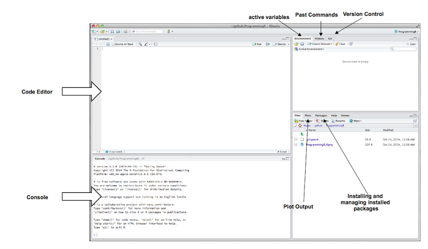

## Getting Started

Setup is very easy

- Download R from CRAN (Comprehensive R Archive Network)
  - http://cran.r-project.org
  - Unpack and install per instructions
  - Comes bundled with an editor, but we will use RStudio
- Install the RStudio editor
  - http://www.rstudio.com/products/rstudio/download/
- After launching RStudio, install packages in 2 ways:
  - Use the Console: e.g. `install.packages(plyr)`
  - Use the GUI: Tools -> Install Packages ...

---

## Basics - Navigating in RStudio
+ R code is executed in the ___Editor___ or the ___Console___.
+ The UI provides windows for viewing data, plots, package documentation, variables, as well as code versionining
+ The Console does tab-completion and provides documentation help


--- 

## Basics - Basic R Data Types
R has three basic data types:

```r
x <- 1.0
y <- "abc"
z <- FALSE
cat("x is a", class(x), ", y is a", class(y), "and z is", class(z))
```

```
## x is a numeric , y is a character and z is logical
```

(`cat()` is a convenience function which concatenates the values passed in)

---

## Basics - Other Data Types
A few other data types worth learning:
+ Vector (1-dimensional container for data of __one__ type)
+ Matrix (2-dimensional container for data of __one__ type)
+ Factor (represents a categorical variable)
+ __Data Frame__ (similar to a SQL table or a MS Excel spreadsheet)

```r
vec <- c(1, 2, 3, 4)
fac <- as.factor(vec)
mat <- matrix(rnorm(100, -2, 4.5), 25, 4)
df <- data.frame(rnorm(c(100, 2), c(10, 20), c(12, 22)))
horsemen <- as.factor(c("White", "Red", "Black", "Pale"))
```

---

## Basics - A Note about the Environment

Code runs within an _environment_, and the variables used are saved in that environment; To find out the contents call:

```r
ls()
```

```
##  [1] "df"        "encoding"  "fac"       "horsemen"  "inputFile"
##  [6] "mat"       "vec"       "x"         "y"         "z"
```
To remove variables from the environment:

```r
rm(horsemen)
ls()
```

```
## [1] "df"        "encoding"  "fac"       "inputFile" "mat"       "vec"      
## [7] "x"         "y"         "z"
```

---


## Working With Data Frames I

Think of a __Data Frame__ as an in-memory SQL table containing various columns (of different type) and rows.  We can read and write data from and to a file:

```r
df <- read.csv("../rTutorial/data.csv", header = FALSE)
colnames(df) <- c("date", "mid", "sid", "clicks", "orders", "gms")
df$date <- as.Date(df$date, format = "%d-%b-%y")
```

```r
write.csv("../rTutorial/new_data.csv")
```
and view useful information about it:

```r
str(df)
```

```
## 'data.frame':	10000 obs. of  6 variables:
##  $ date  : Date, format: "2011-01-01" "2011-01-01" ...
##  $ mid   : int  122 122 122 122 122 122 122 122 122 122 ...
##  $ sid   : int  9020 9020 9020 9020 23803 23803 44769 102935 241849 241849 ...
##  $ clicks: int  0 0 21 3 119 1 545 1 0 12 ...
##  $ orders: int  0 0 3 0 19 0 15 0 0 0 ...
##  $ gms   : num  0 0 126 0 626 ...
```

---


## Working With Data Frames II
The 'summary()' function is a multi-purpose function which displays relevant statistics about each column (it has different uses depending on the type of variable passed in)

```r
summary(df)
```

```
##       date                 mid             sid              clicks       
##  Min.   :2011-01-01   Min.   :  122   Min.   :   9020   Min.   :    0.0  
##  1st Qu.:2011-01-01   1st Qu.: 2417   1st Qu.: 569279   1st Qu.:    1.0  
##  Median :2011-01-01   Median :13828   Median :1386540   Median :    4.0  
##  Mean   :2011-01-01   Mean   :14382   Mean   :1255318   Mean   :  107.4  
##  3rd Qu.:2011-01-01   3rd Qu.:24572   3rd Qu.:1872550   3rd Qu.:   23.0  
##  Max.   :2011-01-01   Max.   :35538   Max.   :2592795   Max.   :46712.0  
##      orders             gms         
##  Min.   :   0.00   Min.   :    0.0  
##  1st Qu.:   0.00   1st Qu.:    0.0  
##  Median :   0.00   Median :    0.0  
##  Mean   :   3.56   Mean   :  382.7  
##  3rd Qu.:   1.00   3rd Qu.:   90.8  
##  Max.   :1082.00   Max.   :70396.2
```

---


## Working With Data Frames III
We will typically be interested in looking at subsets of our data

```r
# first 100 rows and columns 2, 3, 4, and 5
subset0 <- df[1:100, 2:5]
# all rows with mid 3184 and columns "orders" and "gms"
subset1 <- df[df$mid == 3184, c("orders", "gms")]
# vector of dates when mid 25003 had GMS > $10k
subset2 <- df$date[(df$mid == 25003) & (df$gms > 10000)]
```
Subsetting data in R is very flexible and allows you to quickly find and explore the relevant dataset.  Each entry
passed in (such as `df$mid == 25003`) is a boolean vector having the value `TRUE` where the MID matches 25003.  Passing
this boolean vector into a `[]` returns a data frame for all selection where `TRUE` happened.

---

## split-apply-combine with `plyr`
First install the `plyr` package with `install.packages("plyr")` and load it:

```r
require(plyr)
```

A common operation encountered in data analysis is splitting the data frame by a criteria (e.g. for each MID), applying functions to each block e.g. the mean of the GMS column, and the max number of orders), and returning a data frame with the results.  The `plyr` code is simple:

```r
grouped <- ddply(df, .(mid), summarize, avg_gms = mean(gms), max_orders = max(orders))
head(grouped, n = 6)
```

```
##   mid  avg_gms max_orders
## 1 122 130.8494         75
## 2 133   0.0000          0
## 3 147 387.6045         42
## 4 216 188.5871         17
## 5 560   0.0000          0
## 6 732   0.0000          0
```

---


## Plotting with `ggplot2` - (I)
Visualization is an important component of statistical analysis and the `ggplot2` package can generate intuitive plots

---


## Plotting with `ggplot2` - (II)


---


## Plotting with `ggplot2` - (III)


---


## Plotting with `ggplot2` - (IV)


---


## The `shiny` web framework for sharing results
`shiny` is a package developed by RStudio to allow users of R to make their visualizations and results available and interactive in any browser.  The package expects `ui.R` and `server.R` to be present in the current directory before running `runApp()`.  The two files specify the layout of the UI and the data processing, respectively.  The below code was taken from the `shiny` tutorial:

Demo!

---

## Further References
- Introductory R Manual: http://renkun.me/learnR/
- `plyr` tutorial: http://www.slideshare.net/hadley/01-intro-1690565
- `ggplot2`: http://zevross.com/blog/2014/08/04/beautiful-plotting-in-r-a-ggplot2-cheatsheet-3/
- R-Bloggers site keeps up-to-date with all things R: http://www.r-bloggers.com/
- `shiny` tutorial: http://shiny.rstudio.com/tutorial/

---
